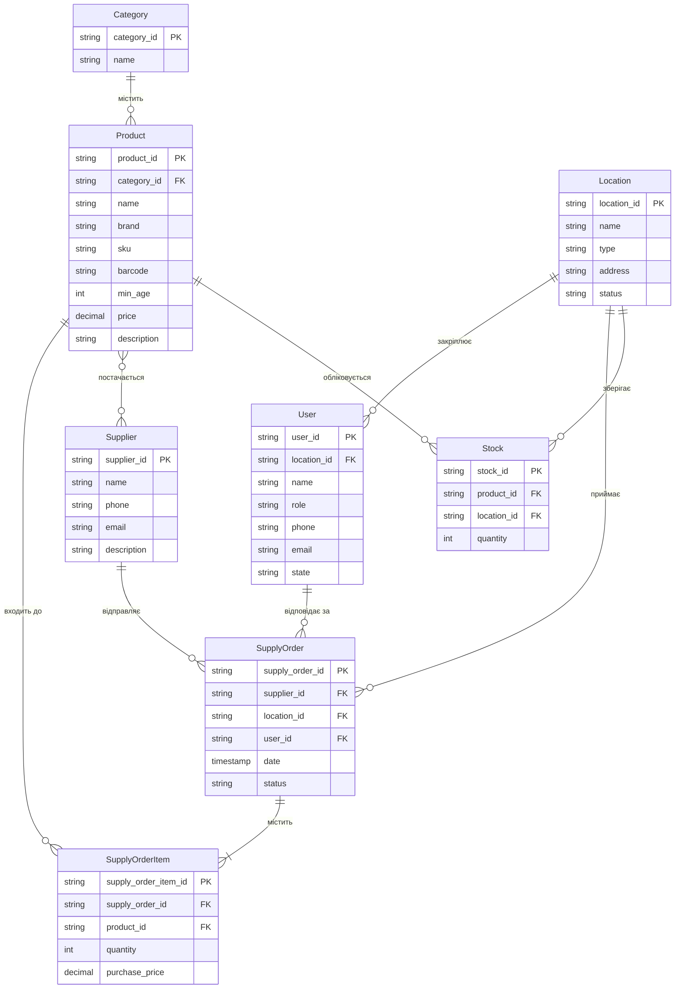

```mermaid
    erDiagram
        Category ||--o{ Product : "містить"
        Product ||--o{ Stock : "обліковується"
        Location ||--o{ Stock : "зберігає"
        Product }o--o{ Supplier : "постачається"
        Supplier ||--o{ SupplyOrder : "відправляє"
        Location ||--o{ SupplyOrder : "приймає"
        User ||--o{ SupplyOrder : "відповідає за"
        Location ||--o{ User : "закріплює"
        SupplyOrder ||--|{ SupplyOrderItem : "містить"
        Product ||--o{ SupplyOrderItem : "входить до"

        Category {
            string category_id PK
            string name
        }

        Product {
            string product_id PK
            string category_id FK
            string name
            string brand
            string sku
            string barcode
            int min_age
            decimal price
            string description
        }

        Location {
            string location_id PK
            string name
            string type
            string address
            string status
        }

        Stock {
            string stock_id PK
            string product_id FK
            string location_id FK
            int quantity
        }

        Supplier {
            string supplier_id PK
            string name
            string phone
            string email
            string description
        }

        SupplyOrder {
            string supply_order_id PK
            string supplier_id FK
            string location_id FK
            string user_id FK
            timestamp date
            string status
        }

        SupplyOrderItem {
            string supply_order_item_id PK
            string supply_order_id FK
            string product_id FK
            int quantity
            decimal purchase_price
        }

        User {
            string user_id PK
            string location_id FK
            string name
            string role
            string phone
            string email
            string state
        }
```