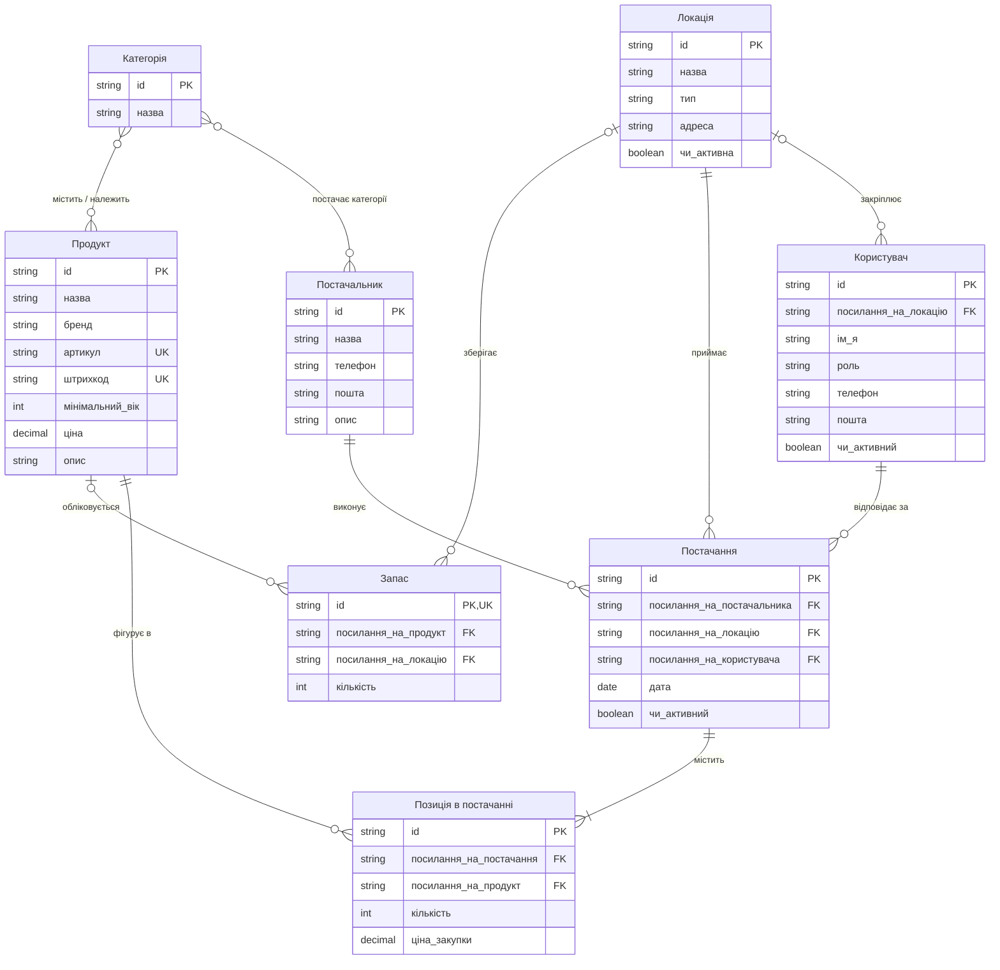

```mermaid
erDiagram
    KATEGORIYA }o--o{ PRODUKT : "містить / належить"
    KATEGORIYA }o--o{ POSTACHALNYK : "постачає категорії"

    PRODUKT |o--o{ ZAPAS : "обліковується"
    LOKATSIYA |o--o{ ZAPAS : "зберігає"

    POSTACHALNYK ||--o{ POSTACHANNYA : "виконує"
    LOKATSIYA ||--o{ POSTACHANNYA : "приймає"
    KORISTUVACH ||--o{ POSTACHANNYA : "відповідає за"

    LOKATSIYA |o--o{ KORISTUVACH : "закріплює"

    POSTACHANNYA ||--|{ POZYTSIYA_POSTACHANNYA : "містить"
    PRODUKT ||--o{ POZYTSIYA_POSTACHANNYA : "фігурує в"

    KATEGORIYA["Категорія"] {
        string id PK
        string назва
    }

    PRODUKT["Продукт"] {
        string id PK
        string назва
        string бренд
        string артикул UK
        string штрихкод UK
        int мінімальний_вік
        decimal ціна
        string опис
    }

    LOKATSIYA["Локація"] {
        string id PK
        string назва
        string тип
        string адреса
        boolean чи_активна
    }

    ZAPAS["Запас"] {
        string id PK, UK
        string посилання_на_продукт FK
        string посилання_на_локацію FK
        int кількість
    }

    POSTACHALNYK["Постачальник"] {
        string id PK
        string назва
        string телефон
        string пошта
        string опис
    }

    POSTACHANNYA["Постачання"] {
        string id PK
        string посилання_на_постачальника FK
        string посилання_на_локацію FK
        string посилання_на_користувача FK
        date дата
        boolean чи_активний
    }

    POZYTSIYA_POSTACHANNYA["Позиція в постачанні"] {
        string id PK
        string посилання_на_постачання FK
        string посилання_на_продукт FK
        int кількість
        decimal ціна_закупки
    }

    KORISTUVACH["Користувач"] {
        string id PK
        string посилання_на_локацію FK
        string ім_я
        string роль
        string телефон
        string пошта
        boolean чи_активний
    }
```