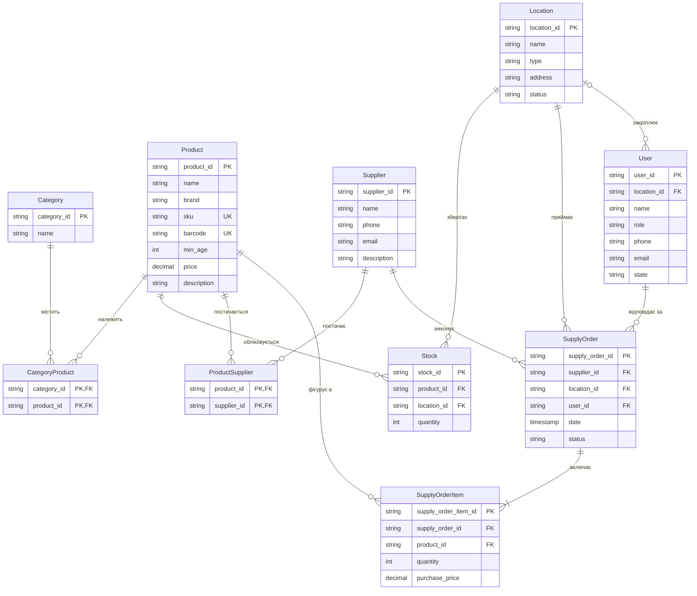

```mermaid
erDiagram
    Category ||--o{ CategoryProduct : "містить"
    Product ||--o{ CategoryProduct : "належить"

    Product ||--o{ Stock : "обліковується"
    Location ||--o{ Stock : "зберігає"

    Product ||--o{ ProductSupplier : "постачається"
    Supplier ||--o{ ProductSupplier : "постачає"

    Supplier ||--o{ SupplyOrder : "виконує"
    Location ||--o{ SupplyOrder : "приймає"
    User ||--o{ SupplyOrder : "відповідає за"

    Location |o--o{ User : "закріплює"

    SupplyOrder ||--|{ SupplyOrderItem : "включає"
    Product ||--o{ SupplyOrderItem : "фігурує в"

    Category {
        string category_id PK
        string name
    }

    Product {
        string product_id PK
        string name
        string brand
        string sku UK
        string barcode UK
        int min_age
        decimal price
        string description
    }

    CategoryProduct {
        string category_id PK, FK
        string product_id PK, FK
    }

    Location {
        string location_id PK
        string name
        string type
        string address
        string status
    }

    Stock {
        string stock_id PK
        string product_id FK
        string location_id FK
        int quantity
    }

    Supplier {
        string supplier_id PK
        string name
        string phone
        string email
        string description
    }

    ProductSupplier {
        string product_id PK, FK
        string supplier_id PK, FK
    }

    SupplyOrder {
        string supply_order_id PK
        string supplier_id FK
        string location_id FK
        string user_id FK
        timestamp date
        string status
    }

    SupplyOrderItem {
        string supply_order_item_id PK
        string supply_order_id FK
        string product_id FK
        int quantity
        decimal purchase_price
    }

    User {
        string user_id PK
        string location_id FK
        string name
        string role
        string phone
        string email
        string state
    }
```