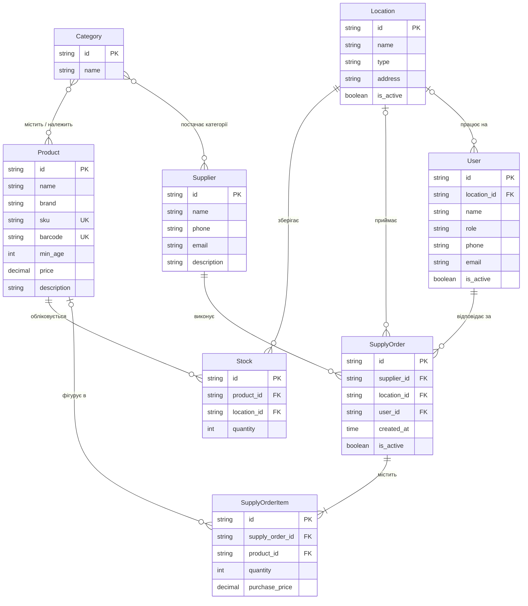

```mermaid
erDiagram
    Category }o--o{ Product : "містить / належить"
    Category }o--o{ Supplier : "постачає категорії"

    Product ||--o{ Stock : "обліковується"
    Location ||--o{ Stock : "зберігає"

    Supplier ||--o{ SupplyOrder : "виконує"
    Location |o--o{ SupplyOrder : "приймає"
    User ||--o{ SupplyOrder : "відповідає за"

    Location |o--o{ User : "працює на"

    SupplyOrder ||--|{ SupplyOrderItem : "містить"
    Product |o--o{ SupplyOrderItem : "фігурує в"

    Category {
        string id PK
        string name
    }

    Product {
        string id PK
        string name
        string brand
        string sku UK
        string barcode UK
        int min_age
        decimal price
        string description
    }

    Location {
        string id PK
        string name
        string type
        string address
        boolean is_active
    }

    Stock {
        string id PK
        string product_id FK
        string location_id FK
        int quantity
    }

    Supplier {
        string id PK
        string name
        string phone
        string email
        string description
    }

    SupplyOrder {
        string id PK
        string supplier_id FK
        string location_id FK
        string user_id FK
        time created_at
        boolean is_active
    }

    SupplyOrderItem {
        string id PK
        string supply_order_id FK
        string product_id FK
        int quantity
        decimal purchase_price
    }

    User {
        string id PK
        string location_id FK
        string name
        string role
        string phone
        string email
        boolean is_active
    }
```